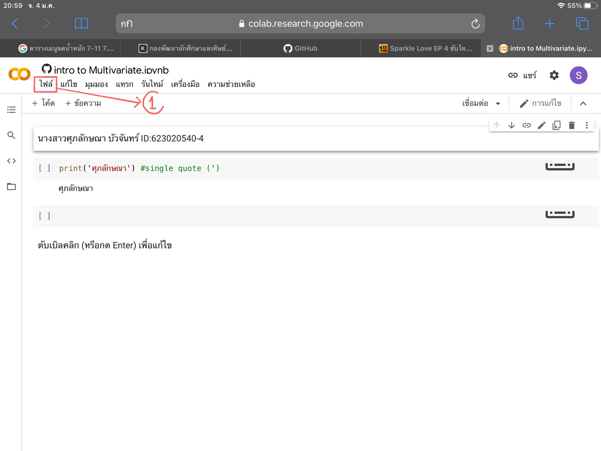
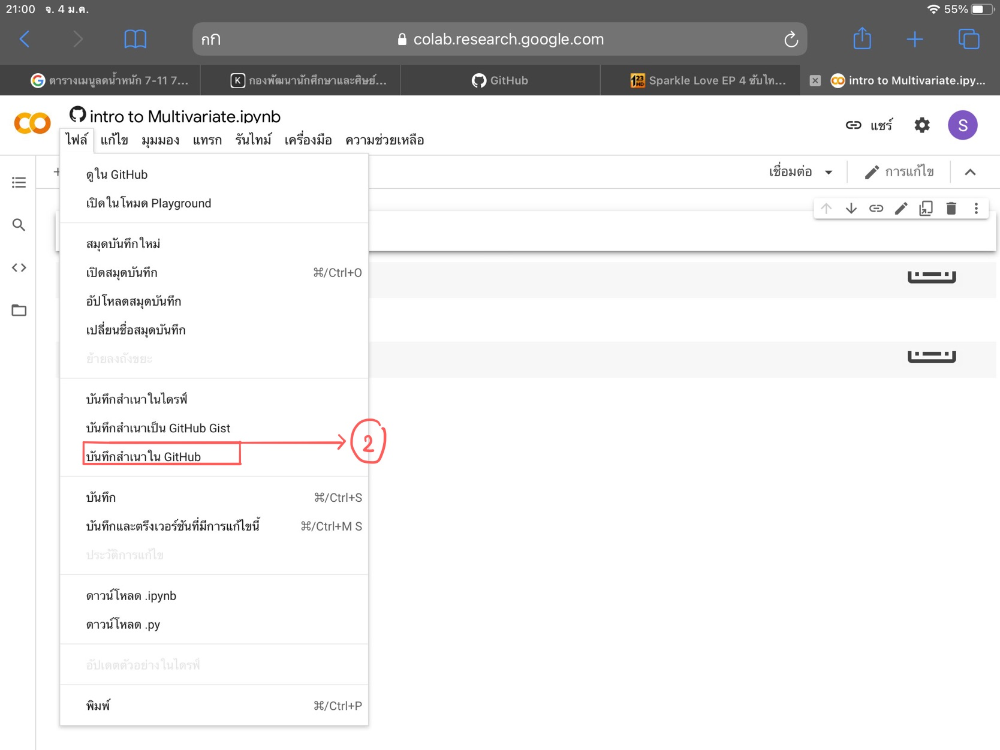
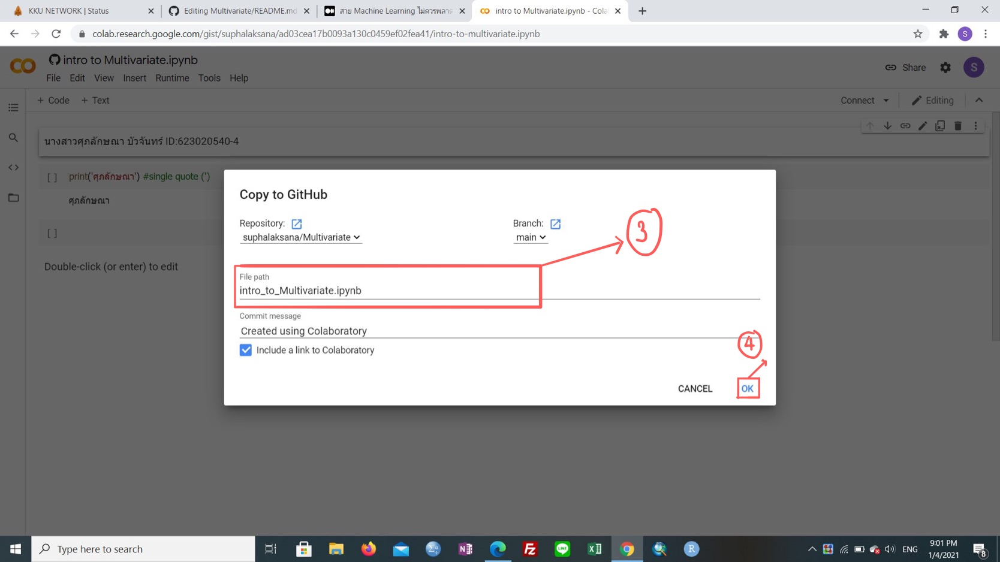
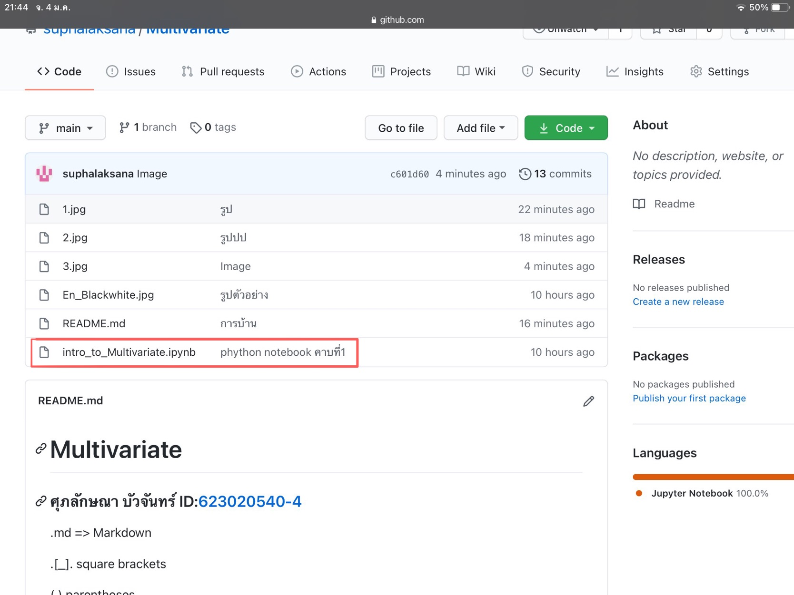

# Multivariate

### ศุภลักษณา  บัวจันทร์ ID:623020540-4

.md => Markdown

.[_]. square brackets

( ) parentheses

อธิบายการใช้งานGithubและ Google colab ว่าหน้าที่ของแต่ละอันคืออะไรและอธิบายวิธีเซฟจากGoogle colab ลง Github

### หน้าที่ของ Github  
คือ เว็บไซต์ที่ให้บริการ Git (version control repository) นั่นเอง โดย Github จะให้บริการบนออนไลน์แพลตฟอร์ม ทำให้สามารถเข้าถึงข้อมูลผ่านหน้าเว็บไซต์ได้ทุกที่ทุกเวลา ในส่วนของการใช้บริการก็มีให้ใช้ทั้งแบบเสียเงินและไม่เสียเงิน หากต้องการใช้บริการแบบฟรี ๆ Code ในโปรเจกต์ของเราทั้งหมด คนอื่นจะสามารถเข้าถึงได้ แต่ถ้าอยากใช้แบบส่วนตัวทาง GitHub ก็มี Plan รองรับในราคาค่าใช้จ่ายที่ไม่สูงมาก

### หน้าที่ของ Google colab 
คือ Jupyter notebook ดัดแปลงที่รันอยู่บนคราวด์ และไม่จำเป็นต้องติดตั้งโปรแกรมใด ๆ ก่อนใช้งาน ซึ่งทุกคนสามารถใช้งานได้ เพียงแค่มีบัญชี Google Drive เพื่อใช้ในการจัดเก็บตัวโค้ดเท่านั้น โดยภาษา Python เป็นภาษาหลักที่ใช้ในการเขียนและรันงานบนเว็บ Colab นี้

### วิธีเซฟจากGoogle colab ลง Github

เมื่อพิมพ์งานเสร็จเรียบร้อยแล้ว ให้กดที่  File ทางซ้ายมือ 

กดเลือก Save a copy in Github หรือ บันทึกสำเนาใน Github

จากนั้นตรงช่อง File path ให้ใส่ชื่อไฟล์ที่เราต้องการ จากนั้นกด OK  ก็เป็นอันเสร็จสิ้น

ไฟล์ถูกเซฟจาก Google colab มาที่ Github เรียบร้อย

